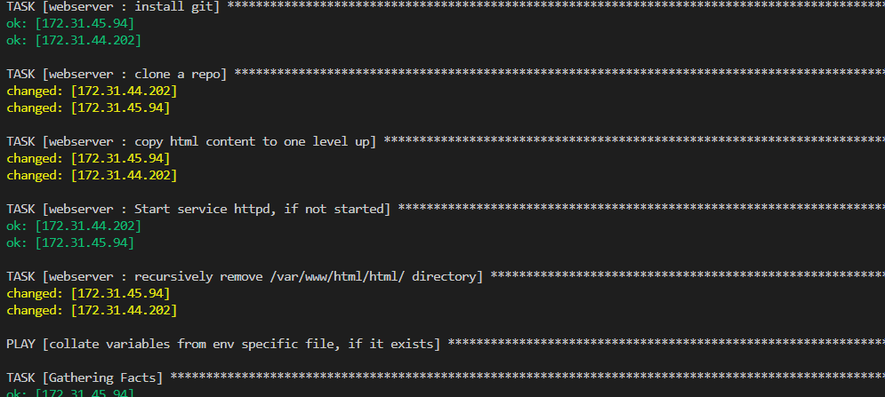

## PROJECT 13

## ANSIBLE DYNAMIC ASSIGNMENTS (INCLUDE) AND COMMUNITY ROLES

**IMPORTANT NOTICE**: Ansible is an actively developing software project, so you are encouraged to visit **Ansible Documentation https://docs.ansible.com/** for the latest updates on modules and their usage.

Last 2 projects have already equipped us with some knowledge and skills on Ansible, so we can perform configurations using **playbooks, roles and imports**. Now we will continue configuring your UAT servers learning and practicing new Ansible concepts and modules.

In this project we will introduce **dynamic assignments** by using **include** module.

What is the difference between **static** and **dynamic** assignments?

Well, from Project 12, we can already tell that static assignments use **import** Ansible module. The module that enables dynamic assignments is **include**.

Hence,

```
import = Static
include = Dynamic
```

When the **import** module is used, all statements are pre-processed at the time playbooks are **parsed**. Meaning, when you execute **site.yml** playbook, Ansible will process all the playbooks referenced during the time it is parsing the statements. This also means that, during actual execution, if any statement changes, such statements will not be considered. Hence, it is static.

On the other hand, when **include** module is used, all statements are processed only during execution of the playbook. Meaning, after the statements are parsed, any changes to the statements encountered during execution will be used.

Take note that in most cases it is recommended to use static assignments for playbooks, because it is more reliable. With dynamic ones, it is hard to debug playbook problems due to its dynamic nature. However, you can use dynamic assignments for environment specific variables as we will be introducing in this project.

## INTRODUCING DYNAMIC ASSIGNMENT INTO OUR STRUCTURE

In your **https://github.com/<your-name>/ansible-config-mgt** GitHub repository start a new branch and call it **dynamic-assignments**.

Create a new folder, name it **dynamic-assignments**. Then inside this folder, create a new file and name it **env-vars.yml**. We will instruct **site.yml** to include this playbook later. For now, let us keep building up the structure.

Your GitHub shall have following structure by now.

Because I used manual method to create the **roles** in github in the previous project, I have **roles** folder(webservers) in my GitHub repository – if I had used **ansible-galaxy**, then roles directory was only created on my Jenkins-Ansible server locally. It is recommended to have all the codes managed and tracked in GitHub.

```
├── dynamic-assignments
│   └── env-vars.yml
├── inventory
│   └── dev
    └── stage
    └── uat
    └── prod
└── playbooks
    └── site.yml
└── roles (optional folder)
    └──...(optional subfolders & files)
└── static-assignments
    └── common.yml
```

Since we will be using the same Ansible to configure multiple environments (prod, uat, staging, dev), and each of these environments will have certain unique attributes, such as servername, ip-address etc., we will need a way to set values to variables per specific environment.

For this reason, we will now create a folder to keep each environment’s variables file. Therefore, create a new folder **env-vars**, then for each environment, create new **YAML** files which we will use to set variables.

Your layout should now look like this.

```
├── dynamic-assignments
│   └── env-vars.yml
├── env-vars
    └── dev.yml
    └── stage.yml
    └── uat.yml
    └── prod.yml
├── inventory
    └── dev
    └── stage
    └── uat
    └── prod
├── playbooks
    └── site.yml
└── static-assignments
    └── common.yml
    └── webservers.yml
```

Now paste the instruction below into the **env-vars.yml** file.

```
---
- name: collate variables from env specific file, if it exists
  hosts: all
  tasks:
    - name: looping through list of available files
      include_vars: "{{ item }}"
      with_first_found:
        - files:
            - dev.yml
            - stage.yml
            - prod.yml
            - uat.yml
          paths:
            - "{{ playbook_dir }}/../env-vars/{{ inventory_file }}.yml"
      tags:
        - always


# - name: collate variables from env specific file, if it exists
#   include_vars: "{{ item }}"
#   with:
#     - "{{ playbook_dir }}/../env_vars/{{ inventory_file }}.yml"
#     - "{{ playbook_dir }}/../env_vars/default.yml"
#   tags:
#     - always
```

Notice 3 things to here:

1. We used **include_vars** syntax instead of **include**, this is because Ansible developers decided to separate different features of the module. From Ansible version 2.8, the **include** module is deprecated and variants of **include_*/** must be used. These are:

- include_role
- include_tasks
- include_vars

In the same version, variants of **import** were also introduces, such as:

- import_role
- import_tasks

2. We made use of a **special variables** `{ playbook_dir }` and `{ inventory_file }`. `{ playbook_dir }` will help Ansible to determine the location of the running playbook, and from there navigate to other path on the filesystem. `{ inventory_file }` on the other hand will dynamically resolve to the name of the inventory file being used, then append **.yml** so that it picks up the required file within the env-vars folder.

3. We are including the variables using a loop. **with_first_found** implies that, looping through the list of files, the first one found is used. This is good so that we can always set default values in case an environment specific env file does not exist.

## UPDATE SITE.YML WITH DYNAMIC ASSIGNMENTS

Update **site.yml** file to make use of the dynamic assignment. (At this point, we cannot test it yet. We are just setting the stage for what is yet to come.)

**site.yml** should now look like this.

```
- hosts: all
  become: true
- name: Include dynamic variables
  import_playbook: ../static-assignments/common.yml
  include_playbook: ../dynamic-assignments/env-vars.yml
  tags:
    - always

- hosts: webservers
- name: Webserver assignment
  ansible.builtin.import_playbook: ../static-assignments/webservers.yml
```

## Community Roles

Now it is time to create a role for MySQL database – it should install the MySQL package, create a database and configure users. But why should we re-invent the wheel? There are tons of roles that have already been developed by other open source engineers out there. These roles are actually production ready, and dynamic to accomodate most of Linux flavours. With Ansible Galaxy again, we can simply download a ready to use ansible role, and keep going.

## Download Mysql Ansible Role
You can browse available community roles here https://galaxy.ansible.com/home

We will be using a **MySQL role developed by geerlingguy**.

**Hint**: To preserve your GitHub in actual state after you install a new role – make a commit and push to master your ‘ansible-config-mgt’ directory. Of course you must have **git** installed and configured on **Jenkins-Ansible** server and, for more convenient work with codes, you can configure Visual Studio Code to work with this directory. In this case, you will no longer need webhook and Jenkins jobs to update your codes on **Jenkins-Ansible** server, so you can disable it – we will be using Jenkins later for a better purpose. 

Then go to **‘ansible-config-mgt’** directory and 

Inside roles directory create your new MySQL role with this command:

```
ansible-galaxy install geerlingguy.mysql
```

 and rename the folder to **mysql** with this command

```
mv geerlingguy.mysql/ mysql
```

Read the **README.md** file, and edit the roles configuration to use correct credentials for MySQL required for the **tooling** website as follows:

```
# Databases.
mysql_databases:
   - name: tooling
     collation: utf8_general_ci
     encoding: utf8
     replicate: 1


# Users.
mysql_users: 
   - name: webaccess
     host: 0.0.0.0
     password: secret
     priv: '*.*:ALL,GRANT'
```

## LOAD BALANCER ROLES

We want to be able to choose which Load Balancer to use, `Nginx or Apache`, so we need to have two roles respectively:

1. Nginx
2. Apache

With the experience on Ansible so far we can:

- Decide if you want to develop your own roles, or find available ones from the community
- Update both `static-assignment` and `site.yml` files to refer the roles

On **Jenkins-Ansible** server  go to **‘ansible-config-mgt’** directory.

Inside **roles** directory create your new Nginx and Apache role with this command

```
ansible-galaxy install geerlingguy.nginx
ansible-galaxy install geerlingguy.apache
```

 and rename the folders to **nginx and apache** respectively with this command

```
mv geerlingguy.nginx/ nginx
mv geerlingguy.apache/ apache
```


Read the **README.md** file, and edit the roles configuration to use correct credentials for apache and nginx as follows:

## NGINX

Update the defaults/main.yml file with this below

```
nginx_upstreams: 
 - name: myapp1
   strategy: "ip_hash" # "least_conn", etc.
   keepalive: 16 # optional
   servers: {
       "web1 weight=3",
       "web2 weight=3",
       "proxy_pass http://myapp1"
     }

nginx_log_format: |
  '$remote_addr - $remote_user [$time_local] "$request" '
  '$status $body_bytes_sent "$http_referer" '
  '"$http_user_agent" "$http_x_forwarded_for"'

enable_nginx_lb: false
load_balancer_is_required: false
```

Handlers/main.yml with this

```
---
- name: restart nginx
  become: yes
  service: name=nginx state=restarted

- name: validate nginx configuration
  become: yes
  command: nginx -t -c /etc/nginx/nginx.conf
  changed_when: false

- name: reload nginx
  become: yes
  service: name=nginx state=reloaded
```
tasks/main.yml with this

```
# Vhost configuration.
- import_tasks: vhosts.yml

- name: set webservers host name in /etc/hosts
  become: yes
  blockinfile: |
    path: /etc/hosts
    block: |
      {{ item.ip }} {{ item.name }}
  loop:
    - { name:web1, ip:172.31.45.94 }
    - { name:web2, ip:172.31.44.202 }
    
# Nginx setup.
- name: Copy nginx configuration in place.
  become: true
  template:
    src: "{{ nginx_conf_template }}"  
    dest: "{{ nginx_conf_file_path }}"
    owner: root
    group: "{{ root_group }}"
    mode: 0644
  notify:
    - reload nginx

- name: Ensure nginx service is running as configured.
  become: true
  service:
    name: nginx
    state: "{{ nginx_service_state }}"
    enabled: "{{ nginx_service_enabled }}"

```

## APACHE

Update the defaults/main.yml with this

```
# Apache package state; use `present` to make sure it's installed, or `latest`
# if you want to upgrade or switch versions using a new repo.
apache_packages_state: present

enable_nginx_lb: false
load_balancer_is_required: false

#webservers
loadbalancer_name: "myapp1"
web1: "172.31.45.94 weight=3"
web2: "172.31.44.202 weight=3"
```

## Important Hints:

- Since you cannot use both **Nginx and Apache** load balancer, you need to add a condition to enable either one – this is where you can make use of variables.

- Declare a variable in **defaults/main.yml** file inside the Nginx and Apache roles. Name each variables **enable_nginx_lb** and **enable_apache_lb** respectively.

- Set both values to false like this `enable_nginx_lb: false` and `enable_apache_lb: false`.

- Declare another variable in both roles `load_balancer_is_required` and set its value to `false` as well

- Update both static-assignment and site.yml files respectively

`loadbalancers.yml` file

```
- hosts: lb
  roles:
    - { role: nginx, when: enable_nginx_lb and load_balancer_is_required }
    - { role: apache, when: enable_apache_lb and load_balancer_is_required }
```

`site.yml file`

```
---
- name: importing common file
  become: true
  import_playbook: ../static-assignments/common.yml
#  import_playbook: ../dynamic-assignments/env-vars.yml
  tags:
    - always

- name: uat-webserver assignment
  import_playbook: ../static-assignments/uat-webservers.yml

# -  name: Include dynamic variables
# -  hosts: all
# -  import_playbook: ../static-assignments/common.yml
# -  import_playbook: ../dynamic-assignments/env-vars.yml
#    tags:
#       -  always


- name: include env-vars file
  import_playbook: ../dynamic-assignments/env-vars.yml
  tags:
     - always

- name: import db files
  import_playbook: ../static-assignments/db.yml

- name: Loadbalancers assignment
  import_playbook: ../static-assignments/loadbalancers.yml
  when: load_balancer_is_required 
   
```

Now you can make use of **env-vars\uat.yml** file to define which loadbalancer to use in UAT environment by setting respective environmental variable to **true**.

You will activate load balancer, and enable **nginx** by setting these in the respective environment’s env-vars file. So paste the code below in the **env-vars\uat.yml**

```
enable_nginx_lb: true
load_balancer_is_required: true
```

The same must work with **apache** LB, so you can switch it by setting respective environmental variable to **true** and other to **false**.

Go to nginx/defaults/main.yml and change to true 

enable_nginx_lb: true
load_balancer_is_required: true

In summary, the site.yml is the main playbook which: 
- Imports the uat-webservers.yml playbook located in the static-assignments folder which in turn contains the role (uat-webserver) that contains the actual playbook at the tasks folder.

- Imports the loadbalancers.yml playbook located in the static-assignments folder which in turn contains the role (apache and nginx) that contains the actual playbook at the tasks folder.

- Imports the db.yml playbook located in the static-assignments folder which in turn contains the role (mysql) that contains the actual playbook at the tasks folder.

- Contains the dynamic-assignments which determines whether to install apache or nginx loadbalancer.

To test this, you can update inventory for each environment and run Ansible against each environment.

```
cd ansible-config-mgt

ansible-playbook -i inventory/uat.yml playbooks/site.yml
```


## Blockers
When i checked for the uat-webservers ip address in the /etc/hosts file, I could not find the address of one the two uat-webservers (sudo cat /etc/hosts)


I had to edit the part of the nginx/tasks/main.yml like this

```
- name: set webservers host name in /etc/hosts
  become: yes
  ansible.builtin.lineinfile:
    path: /etc/hosts
    line: "{{ item.ip }} {{ item.name }}"
  with_items:
    - { name: web1, ip: 172.31.45.94 }
    - { name: web2, ip: 172.31.44.202 }
```





Though the problem persisted but with other troubleshooting the issue was resolved


Checking for /etc/hosts file 


## Nginx Loadbalancer Failure

After shutting down my system after the days work, on booting up my system on the following day, I noticed that nginx loadbalancer is down and when I tried restarting it was giving me this error


So i had to run a test command checking for the syntax error on the /etc/nginx/nginx.conf with these two commands, it gave me where the issue is comming from:

```
sudo nginx -t

sudo nginx -t -c /etc/nginx/nginx.conf
```


I went to the /etc/nginx/nginx.conf file and commented out the portion for the "server proxy_pass http://myapp1;"

So that my loadbalancer can be able to send traffic to my webservers , I have to insert following configuration into http section:

```
server {
    listen 80;
    server_name www.domain.com;
    location / {
      proxy_pass http://myproject;
    }
  }
```

And also commented out this line below in the above /etc/nginx/nginx.conf file
#       include /etc/nginx/sites-enabled/*;

I restarted nginx, checked for syntax error, checked the status, checked the browser and everything works fine.


## End of Project 13

